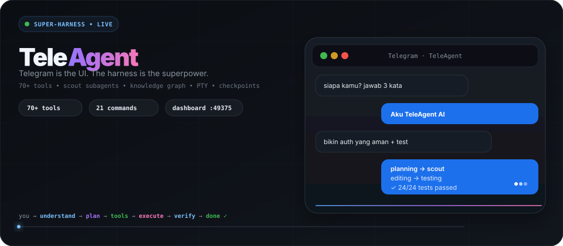
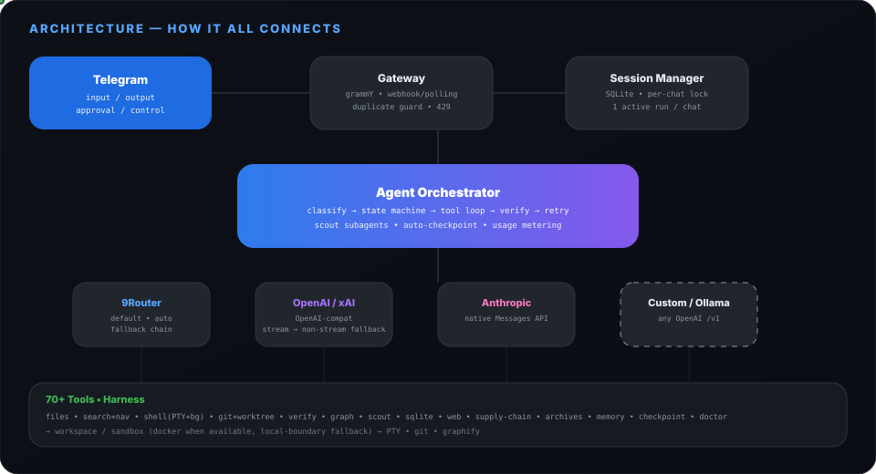
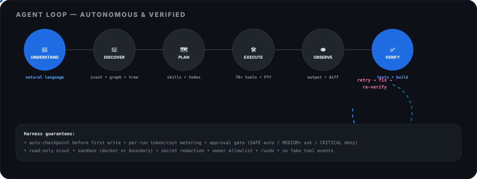

<p align="center">
  <a href="https://github.com/Graphify-Labs/graphify"></a>
  <a href="#"></a>
  <a href="#"></a>
  <a href="#"></a>
</p>

<p align="center">
  
</p>

<h1 align="center">TeleAgent <span style="color:#8a5cf6">— super-harness coding agent di Telegram</span></h1>

<p align="center">
  <b>Telegram cuma jadi remote.</b> Otaknya di server kamu. <br/>
  Ketik pakai bahasa manusia → agent paham → plan → pakai <b>70+ tools beneran</b> → test → fix → verify → laporan.<br/>
  <sub>no mock • no dummy • no fake • semua tool beneran nge-run • ada bukti: file changed, test output, build result</sub>
</p>

<p align="center">
  <a href="#-quick-start-1-menit"><b>Quick start</b></a> •
  <a href="#-apa-yang-bisa-dilakuin">Contoh</a> •
  <a href="#-slash-commands--full-control">Slash commands</a> •
  <a href="#%EF%B8%8F-dashboard--tui">Dashboard</a> •
  <a href="#-tools-70-real">Tools</a> •
  <a href="#-architecture">Arsitektur</a>
</p>

---

## ✨ Kenapa TeleAgent rame?

> Capek buka laptop cuma buat `npm test`, `git diff`, `grep -r`?  
> TeleAgent bikin **Telegram jadi VS Code + terminal + CI** — dari HP, dari warung, dari Termux.

- **Ngomong aja, gak perlu hafal command.** `"cek kenapa build gagal, perbaiki, test lagi sampai pass"` → agent ngerti sendiri mau ngapain.
- **Harness beneran, bukan chat wrapper.** 70+ tools real: baca/tulis file, PTY shell, background `npm run dev`, git + worktree, sqlite, secret scan, audit deps, coverage, sampai scout subagent yang riset codebase pakai fresh context.
- **Aman by default.** Risk `SAFE→CRITICAL`: auto / tanya dulu / tolak. `rm -rf /`, `mkfs`, `shutdown`, ambil host filesystem → langsung `CRITICAL deny`. SSRF blok, upload cek traversal & zip-bomb, secret di-redact.
- **Ringan di mana aja.** Idle 60–120 MB, SQLite WAL (gak butuh Redis/Postgres kecuali mau scale), jalan di VPS, Linux, macOS, Windows, bahkan **Android Termux**.
- **Dashboard + TUI se-live Telegram.** Status, run, approval (approve/reject 1-klik), usage, audit — semua ada di `http://localhost:49375` dan di `npm run tui` (SSH-friendly).

---

## 🪄 Apa yang bisa dilakuin? (vibe coder → tinggal ketik)

```text
dika: tolong cek project ini, cari kenapa build gagal, perbaiki, jalankan test, kalau masih error lanjut perbaiki.

agent:
🧠 analyzing workspace...
🔎 inspecting package.json
📂 reading 7 files
🛠 editing src/auth/middleware.ts
▶️ running npm test
❌ 2 tests failed
🔧 fixing failures
▶️ running tests again
✅ 24/24 tests passed
📦 build completed

siap. aku nemu middleware auth yang salah handle token expiry, udah benerin + tambah test.
```

Lebih banyak prompt yang langsung jalan:

```text
"bikin authentication system yang aman di project ini"
"refactor bagian database supaya lebih cepat"
"baca semua source code dan jelasin architecture-nya"
"implementasi dark mode, test semuanya, jangan berhenti sampai build berhasil"
"cari bug yang bikin memory leak lalu perbaiki"
"review project ini dan perbaiki semua issue yang kamu temuin"
"siapa kamu? jawab 3 kata"  →  "Aku TeleAgent AI ✨"  (chat murni juga dijawab bener, bukan cuma coding)
```

---

## 🧰 Tools — 70+ real, bukan simulasi

| group | tools | catatan |
|---|---|---|
| **files** | `read_file write_file edit_file apply_patch delete_file move_file copy_file list_directory tree read_many file_exists file_info` | `apply_patch` atomik (gagal 1 → gak ada file yang keubah) |
| **search + nav** | `glob find_files grep search_code find_definition find_references symbol_outline` | offline, deterministik di semua OS (gak tergantung `rg`/`grep` beda platform) |
| **shell** | `shell shell_batch shell_start shell_poll shell_input shell_kill` | `shell_start` = background session (jalanin `npm run dev`, `uvicorn`, `go run` sambil ngobrol) |
| **git** | `git_status git_diff git_log git_show git_branch git_checkout git_commit git_stash git_worktree_*` | worktree = kerja paralel di branch beda tanpa ganggu checkout utama |
| **verify** | `npm_test npm_build npm_install detect_pm coverage_report lint_tool typecheck_tool format_code` | executor yang pilih command beneran (bukan model ngarang `npm test`) |
| **graph** | `graphify_status graphify_build graphify_query graphify_path graphify_explain` | knowledge graph lokal (tree-sitter, gak perlu API key buat indexing code) |
| **subagent** | `scout` | subagent read-only, 8 langkah max, gak bisa nulis — buat riset codebase paralel |
| **data** | `sqlite_query` (SELECT/WITH only, bounded di workspace), `export_session` | query `.db` project langsung |
| **web** | `http_get http_post http_download fetch_text web_search api_check` | SSRF-protected; `web_search` tanpa API key (best-effort) |
| **supply** | `dep_add audit_deps outdated_deps secret_scan` | `secret_scan` nilai disensor; fallback JS biar jalan di Windows/Termux |
| **source** | `repo_clone` (https/ssh only), `github_issues github_prs github_pr_diff` |  |
| **plan/memory** | `todo_write todo_list memory_remember memory_recall project_profile env_info checkpoint_create checkpoint_restore doctor_check quota_status` |  |
| **system** | `process_list process_kill` (+ `browser_*` kalau worker di-set) |  |

**Harness guarantees:**
- auto-checkpoint sebelum tulis pertama di tiap run → `/undo` selalu bisa balikin
- token/cost per-run tercatat → dashboard Usage & `/usage` live beneran
- `git --stat` ditempel di ringkasan selesai
- gak ada `tool.started` palsu — event cuma dikirim setelah tool beneran dipanggil & hasilnya balik
- run yang gagal **gak pernah** dilaporin sukses: `agent_runs_success` / `agent_runs_failed` / `agent_runs_degraded` di `/metrics` beda-beda dan dihitung dari hasil nyata

---

## 🧭 Agent loop — plan dulu, baru gerak

Agent nggak langsung nembak tool. Tiap request dibikin **plan asli** (deterministik, gak butuh provider — jadi tetep ada walau upstream mati):

```text
objective → steps (discover → implement → verify → report)
                 ├─ tools yang dipakai per step
                 ├─ verification commands (dibaca dari project profile beneran)
                 ├─ assumptions + risks
                 └─ completion criteria
```

- **Adaptive, bukan kaku.** Kalau tool yang sama gagal `AGENT_REPLAN_AFTER` kali, plan direvisi: step gagal ditandai, step "diagnose" disisipin, pendekatan diganti. Kalau tetap mentok setelah 2 replan → berhenti dengan `blocked: <tool> failed N× …` + daftar yang udah dicoba + error terakhir. Nggak loop selamanya.
- **Smart tool selection.** Chat = 0 tool. Analisa = read-only (search/graph/baca). Implementasi = read + write + shell + verify. **Tulis file baru kebuka setelah codebase dibaca** — biar gak ngarang.
- **Context window nyata.** Output tool yang panjang dipotong head+tail, riwayat lama dilipat jadi ringkasan yang keliatan (`[context compacted — N …]`), dibatasi `AGENT_MAX_CONTEXT_CHARS`. Objective + turn terakhir gak pernah dibuang.
- **Failure memory.** Pola gagal yang berulang (di-fingerprint, bebas secret) disimpen per-workspace, dipakai buat warning run berikutnya, dan ditutup otomatis begitu tool-nya sukses.
- **Provider circuit breaker.** Provider yang gagal 3× berturut-turut di-skip selama cooldown (bukan 200 round-trip sia-sia per run), probe lagi begitu cooldown habis.
- **Batasan keras.** `AGENT_MAX_STEPS` + `AGENT_TIMEOUT_MS` — kena limit = verification pass terakhir + laporan jujur (jalan atau gagal), bukan pura-pura beres.

Plan bisa dilihat langsung: dashboard tab **Diagram → Agent Plan**, `GET /api/plan/:runId`, `GET /api/plan?sessionId=…`, `GET /v1/runs/:id` (field `plan`), atau TUI `plan [runId]`.

---

## ⌨️ Slash commands — full control (natural language tetap jalan)

Ketik `/` di Telegram → muncul autocomplete. Semua command juga ada tombol inline.

| command | buat apa | cara pakai |
|---|---|---|
| `/start` | welcome + status koneksi | `/start` |
| `/help` | bantuan lengkap di chat | `/help` |
| `/status` | session, provider/model, workspace, run aktif & terakhir | `/status` |
| `/settings` | panel settings (tombol) | `/settings` |
| `/model <name>` | ganti model buat chat ini | `/model cbai/minimax-m3` |
| `/provider <name>` | ganti provider | `/provider openai` |
| `/workspace <name>` | pindah workspace (fuzzy match) | `/workspace my-project` |
| `/new` | sesi baru, history lama tetap di DB | `/new` |
| `/stop` (`/cancel`) | batalin run aktif (matiin model + PTY + proses) | `/stop` |
| `/pause` / `/resume` | jeda/lanjut run, state ke-save | `/pause` |
| `/retry` | ulang pesan terakhir kamu | `/retry` |
| `/diff` | lihat perubahan belum di-commit (+ file `.diff` kalau gede) | `/diff` |
| `/log [n]` | log tool-call run terakhir (✓/✗, risk, ms, exit) | `/log 30` |
| `/undo` | balikin checkpoint terbaru (stashes dulu biar gak hilang) | `/undo` |
| `/approvals` | list approval pending | `/approvals` |
| `/approve <id>` | setujui (cukup digit awal) | `/approve a8f31d` |
| `/reject <id>` | tolak; agent cari jalan lain | `/reject a8f31d` |
| `/usage` | token hari ini/kuota + lifetime runs/cost | `/usage` |
| `/doctor` | diagnosa 12 subsistem (token/db/workspace/disk/RAM/provider/circuit/graphify/sandbox/pty/node) PASS-WARN-FAIL + hint aksi | `/doctor` |
| `/graph <q>` | tanya knowledge graph | `/graph what connects auth to db?` |

> Kata biasa juga bisa: ketik `stop`, `pause`, `resume` tanpa `/` → sama aja.

---

## 🚀 Quick start — 1 menit

```bash
git clone <repo> && cd teleagent
cp .env.example .env   # isi TELEGRAM_BOT_TOKEN + PROVIDER_API_KEY
npm install
npm run setup          # bikin data/ + workspaces/default + copy .env kalau belum ada
npm run dev            # bot polling + API + dashboard di :49375
```

Buka dashboard: **http://localhost:49375**

Production (butuh Postgres/Redis + sandbox worker):

```bash
docker compose up -d
```

Terminal UI (buat SSH / Termux tanpa browser):

```bash
npm run tui
# status | sessions | runs | approvals | workspaces | providers | usage | audit | settings | graphify | doctor
```

---

## ⚙️ Config — satu provider universal (gak bikin pusing)

`.env.example` cuma punya **1 blok provider** — ganti `PROVIDER` + isi 1 key, jadi:

```env
PROVIDER=9router
PROVIDER_BASE_URL=
PROVIDER_API_KEY=sk-xxxx
PROVIDER_MODEL=auto
```

| `PROVIDER` | butuh apa | endpoint default |
|---|---|---|
| `9router` | `PROVIDER_API_KEY` (gateway lokal `http://localhost:20128/v1`) | 9Router |
| `openai` | `sk-...` | `https://api.openai.com/v1` |
| `xai` | `xai-...` | `https://api.x.ai/v1` |
| `anthropic` | `sk-ant-...` | `https://api.anthropic.com` (native) |
| `ollama` | — (bisa tanpa key) | `http://localhost:11434/v1` |
| `custom` | `PROVIDER_BASE_URL=https://...` + key + `PROVIDER_MODEL` | endpoint kamu |

Mau override endpoint bawaan? Isi aja `PROVIDER_BASE_URL` — cuma ngaruh ke `PROVIDER` yang lagi dipilih, gak bocor ke lain.  
`PROVIDER_MODEL=auto` = router pilih model per task + fallback chain.  
`PROVIDER_MODEL_FALLBACK=cph/cehpoint-ai` (boleh koma: `model-a,model-b`) = model cadangan **dengan key yang sama** — dicoba otomatis kalau model utama 429/500/down. Provider yang gagal 3x beruntun masuk circuit-breaker cooldown 60 detik (kelihatan di `/doctor` → `circuit` dan `GET /api/circuit`).

Full `.env` lihat `cp .env.example .env` — ada komentar cara pakai tiap provider + TELEGRAM, workspace, sandbox, rate limit, dsb.

---

## 🖥️ Dashboard & TUI — live, bukan mock

<p align="center"><i>Dashboard dependency-free (HTML+JS doang, jalan offline di HP) + TUI readline buat SSH/Termux</i></p>

- **Status** — health (telegram/db/sandbox/pty/workspace/provider), counts (sessions/runs/tool calls/approvals)
- **Sessions / Runs** — list + tombol **stop** per run
- **Approvals** — list pending + **approve/reject** 1-klik (juga bisa via `/approve` di Telegram)
- **Workspaces** — deteksi otomatis `language/framework/pm/test/build`
- **Providers** — health cuma dicek buat `PROVIDER` aktif (biar gak nyesatin)
- **Usage** — token harian/sisa kuota + lifetime cost (estimated, tercatat per-run beneran)
- **Audit** — log tool, risk, approval, exit, durasi (secret udah di-redact)
- **Settings** — simpan setting; secret (`*token*`, `*key*`, `*secret*`) ditolak 403 — cuma via `.env`
- **Graphify** — status/build/query/path/explain langsung dari dashboard

TUI command: `status | sessions [n] | runs [sid] | stop <id> | approvals | approve <id> | reject <id> | usage | audit | workspaces | providers | graphify <ws> | settings | set <k> <v> | metrics | doctor | help | quit`

---

## 🧠 Knowledge graph harness (Graphify)

Opsional tapi bikin agent jauh lebih pinter — dia query graph, bukan grep buta:

```bash
uv tool install graphifyy   # atau: pipx install graphifyy  (Python 3.10+)
```

Indexing code **100% lokal** (tree-sitter, gak pakai LLM, gak keluar mesin). Agent auto-detect CLI:

`graphify_status` → kalau belum ada graph → `graphify_build` (offline) → `graphify_query / path / explain`.

Kalau CLI belum ada, tool graph jujur balikin instruksi install + agent fallback ke `search_code`/`grep`. Dashboard tab Graphify & `npm run tui → graphify <ws>` nunjukin status yang sama.

---

## 🏗️ Architecture

<p align="center"></p>

```text
Telegram
   │
   ▼
Gateway (grammY, webhook/polling, duplicate guard, 429 retry)
   │
   ▼
Session Manager (SQLite WAL, per-chat lock, 1 active run/chat)
   │
   ▼
Agent Orchestrator ──→ Providers (9Router/openai/xAI/Anthropic/ollama/custom)
   │                        │
   │                        ▼
   │                   NativeRuntime
   │                   understand → discover → plan → tools → observe → verify → retry
   │
   └────→ Tool Executor (70+ tools) → Workspace / Sandbox (PTY, git, graphify)
                                            │
                              Dashboard :49375 + TUI (same live data)
```

<p align="center"></p>

- `src/config` • `src/database` (SQLite single-node; Postgres via compose)
- `src/providers` (OpenAI-compat streaming + non-stream fallback + Anthropic native + router)
- `src/tools` (filesystem, search+nav, shell+PTY+bg, git+worktree, verify, graph, scout, sqlite, web, supply-chain, archives, memory, checkpoint, doctor)
- `src/runtime` (NativeRuntime + CLI adapters: opencode/codex/claude/gemini/generic)
- `src/agent` (orchestrator, state machine, context, skills, memory, verification, checkpoint, recovery, multi-agent)
- `src/security` (risk/policy, command parser, SSRF, upload validation, access, rate-limit, audit, secret redaction)
- `src/telegram` (gateway, renderer, keyboards, 21 slash commands, archive auto-extract)
- `src/dashboard` (zero-dep web), `src/tui` (readline), `src/sandbox`, `src/workspace`, `src/api`, `src/observability`, `src/plugins`

---

## 🌐 API

- `GET /` dashboard • `GET /api/status` (public) • `GET /health /ready /metrics`
- `GET /api/sessions /api/runs /api/approvals/pending /api/workspaces /api/providers /api/usage /api/audit /api/settings /api/memory`
- `POST /api/settings` (secret ditolak 403) • `POST /api/approvals/:id` • `POST /api/runs/:id/stop`
- `POST /api/graphify/build|query|path|explain` • `GET /api/graphify/status|html|report` • `GET /api/diagram`
- `POST /v1/sessions` • `GET /v1/sessions[/:id]` • `POST /v1/sessions/:id/messages|stop|pause|resume`
- `GET /v1/workspaces` • `POST /v1/workspaces` • `GET /v1/providers` • `GET /v1/models`
- `GET /v1/runs/:id` (run + tool calls) • `GET /v1/runs/:id/events`
- `WS /v1/ws/sessions/:id` (push status tiap 3s) • `POST /v1/chat/completions` (OpenAI-compatible gateway)
- `POST /telegram/webhook` (production: validasi `x-telegram-bot-api-secret-token` lalu update-nya diteruskan ke bot yang jalan • `503` kalau prosesnya cuma API tanpa bot)

Semua endpoint di atas (kecuali `/`, `/api/status`, `/health`, `/ready`, `/metrics`, `/v1/providers`) butuh `TELEAGENT_API_KEY` kalau diakses dari luar loopback. Tanpa key, akses remote ditolak `401` — dashboard lokal tetap jalan normal.

---

## 💻 Jalan di mana aja — VPS, Linux, Termux, Windows, macOS

**VPS / Linux server**
```bash
curl -fsSL https://deb.nodesource.com/setup_22.x | sudo -E bash - && sudo apt install -y nodejs git
git clone <repo> && cd teleagent && cp .env.example .env && npm install && npm run setup
npm run dev          # atau: docker compose up -d  (nambah postgres/redis/sandbox worker)
```
systemd: jalanin `npm start` pakai `Restart=always`, simpen `/data` + `/workspaces` di volume.

**Linux desktop** — sama, dashboard di http://localhost:49375.

**Android (Termux)**
```bash
pkg update && pkg install nodejs git python -y
git clone <repo> && cd teleagent && cp .env.example .env && npm install && npm run setup
npm run dev
```
Tips: pakai `npm run tui` buat kontrol (gak butuh browser); sandbox jalan mode local-boundary (Docker gak ada di Android); simpen `WORKSPACE_ROOT` di internal storage; biar gak ke-kill pakai `termux-wake-lock` atau `tmux`.

**Windows (10/11)**
```powershell
winget install OpenJS.NodeJS.LTS Git.Git
git clone <repo>; cd teleagent; copy .env.example .env; npm install; npm run setup
npm run dev
```
`tar`/`Expand-Archive` bawaan Windows jadi archive tools jalan; `shell_start` otomatis pakai PowerShell di win32; buat sandbox Docker pakai WSL2 + Docker Desktop `docker compose up -d`.

**macOS** — `brew install node git`, terus quick start biasa.

> Idle 60–120 MB RAM, gak ada background thread selain run aktif. SQLite WAL buat single-node (gak butuh service tambahan); Redis/Postgres cuma buat scale.

---

## 🔒 Safety — bukan cuma tulisan

| layer | gimana |
|---|---|
| **Risk gate** | `SAFE/LOW` auto • `MEDIUM/HIGH` tanya dulu (inline Approve/Reject + dashboard) • `CRITICAL deny` |
| **Command parser** | Blok `rm -rf /`, `mkfs`, `shutdown`, `dd of=/dev`, `curl|sh`, akses `../../etc/shadow`, `useradd/passwd`, `iptables` — termasuk `shell_start`/`shell_input` & batch |
| **SSRF** | Blok `localhost`, `127.0.0.1`, `10/8`, `172.16/12`, `192.168/16`, `169.254.169.254`, `metadata.google.internal`, `*.internal/*.local` |
| **Upload** | Validasi nama/mime/size, ekstensi allowlist, cek traversal & symlink, zip-bomb (`uncompressed/compressed >100 & >50MB`) |
| **Secret** | `.env`, `.ssh`, `credentials`, SSH key → `protected` (gak masuk LLM context); audit log `api_key=********` |
| **Isolation** | per-user `chat → session → workspace → sandbox`, filesystem boundary, `HOME/PATH/WORKSPACE/TEMP` terkontrol, CPU/RAM/pids limit di Docker |
| **Auth** | `BOT_ACCESS_MODE=owner|private|public|allowlist` + `OWNER_IDS`/`ALLOWED_*` — dicek di tiap handler, bukan cuma Telegram |
| **API exposure** | `HOST` default `127.0.0.1` — tanpa `TELEAGENT_API_KEY`, semua endpoint mutasi (approval, settings, provider config, stop run) cuma dari localhost |
| **Workspace boundary** | nama workspace gak bisa kabur: `../..`, path absolut, & symlink keluar `WORKSPACE_ROOT` → ditolak |
| **Rate & cost** | `messages/min`, `runs/hour`, `tokens/day`, concurrency `MAX_CONCURRENT_RUNS` |

---

## 🛠️ Dev & test

```bash
npm run typecheck   # tsc --noEmit
npm run lint        # cek secret hardcode + style
npm run build       # tsc -> dist/
npm test            # vitest run  (127 passing)
npm run dev         # watch bot
npm run tui         # terminal UI
```

Quality gates sebelum release: `typecheck`, `lint`, `test`, `build` harus 0 error, plus smoke test `curl localhost:49375/` & `curl /api/status`.

---

## 🤝 Biar rame — star, fork, PR welcome!

TeleAgent dibikin biar **vibe coder, gen Z, solo dev, sampai tim** bisa ngoding dari Telegram tanpa ribet. Kalau kamu suka:

- ⭐ **Star** repo ini — biar makin kelihatan di explore
- 🍴 **Fork** + bikin fitur kamu sendiri (plugin `AgentPlugin` gampang banget)
- 💬 **Share** ke temen yang ngoding dari HP / Termux

Punya ide tool baru? Bikin `src/tools/*.ts` + daftarin di `src/tools/registry.ts` + tulis test di `tests/*.test.ts` — PR auto di-test 127 suite. No gatekeeping, no drama.

> Built with 💜 for builders yang pengen **ngoding sambil rebahan, tapi harness-nya super power.**

---

## 📄 License

MIT — pakai, fork, komersil bebas. Jangan lupa kasih star ya 😉
